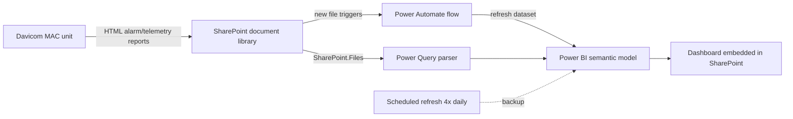

# Broadcast Reliability Dashboard: Davicom Transmitter Monitoring

An automated Power BI pipeline that turns alarm and telemetry reports from Davicom MAC transmitter-site controllers into a live reliability dashboard. Built for a multi-station radio facility at my workplace and shared with engineers at other facilities to reuse.


> **Note on data:** Screenshots come from the production deployment, with site names, call signs, logos, URLs, and account details redacted. Everything in `sample-data/` is fictional (a made-up site with call signs CXRA–CXRD) so the project can be run without any real data.

## The Problem

Davicom MAC units at transmitter sites monitor everything that keeps a station on air: program audio feeds, STL (studio-to-transmitter link) RF power, AC mains, generator status, GPS/PTP timing, and equipment-room temperature and humidity. The units export this as **HTML reports**. That works for reading one report at a time, but it gives engineers no way to:

- see trends over time (is a link's power drifting? is the room getting hotter?)
- measure how long each dead-air (silence) event lasted
- check the health of a whole site at a glance
- share a consistent view with other facilities

## The Solution



1. **Ingestion.** Davicom reports land in a SharePoint document library.
2. **Parsing.** A Power Query (M) parser reads every report in the folder and splits each into an **Alarms** table (timestamped fault/clear events) and a **Telemetry** table (analog readings and digital status points).
3. **Transformation.** Downstream queries derive the tables the dashboard needs: silence events with durations, current station status, infrastructure health, and a clean alarm log.
4. **Event-driven refresh.** A Power Automate flow triggers when a new report arrives, waits for the upload to finish, then refreshes the Power BI dataset, so the dashboard updates within minutes of a new report.
5. **Backup refresh.** A 4x-daily scheduled refresh catches anything the flow misses.
6. **Delivery.** The report is embedded on a SharePoint page where engineers already work.

## How It Works

### Silence (dead-air) detection
For every `Air Feed Silence` alarm, the `SilenceEvents` query finds the next `Air Feed OK` alarm on the same Davicom channel and calculates the outage duration. This turns raw alarm rows into a reliability metric: how often each station goes silent, and for how long.

### Infrastructure health checks
`InfrastructureHealth` compares each critical digital point (utility power, generator mode, generator battery, PTP clock lock, GPS sync) against its **expected** state for the site. Points that match show as *Healthy*; anything else shows as *Attention*. This avoids hardcoding "H = good", since the correct state depends on how each input is wired.

### Telemetry parsing
Analog values arrive as text with units attached (`208.324Vac`, `83.5123F`). The `Telemetry` query separates the numeric value from the engineering unit so values can be charted and compared.

## Dashboard

| Section | What it shows |
|---|---|
| KPI cards | Stations monitored, reports processed, silence events, average silence duration, power source, generator status |
| Air Feed Silence Duration | Duration of each dead-air event, by station |
| TSR Temperature Trend | Transmitter-site room temperature over time |
| STL 1 Forward Power Trend | Studio-to-transmitter link RF power over time |
| Electrical & Facility Telemetry | Latest AC phase voltages, STL power, humidity |
| Infrastructure Health | Status tiles for power, generator, and timing systems |
| Current Station Status | Air feed, program, and MTS status per station |
| Recent Alarm Log | Latest alarms with color-coded severity |

### Automation

| | |
|---|---|
|  |  |
| Power Automate flow: new file → condition → delay → refresh | Successful test run |
|  |  |
| Trigger watching the SharePoint report folder | Backup scheduled refresh, 4x daily |


*The dashboard embedded on a SharePoint page.*

## Repository Contents

```
├── powerquery/          Power Query (M) code, one file per query, in dependency order
│   ├── 01_Davicom.pq        HTML parser: folder of reports → Alarms + Telemetry
│   ├── 02_Alarms.pq         Alarms output of the parser
│   ├── 03_TelemetryRaw.pq   Telemetry output of the parser
│   ├── 04_Telemetry.pq      Numeric values, units, digital states
│   ├── 05_Reports.pq        One row per report file
│   ├── 06_AlarmLog.pq       De-duplicated alarm history
│   ├── 07_SilenceEvents.pq  Silence → clear matching and durations
│   ├── 08_StationStatus.pq  Latest air feed / program / MTS status per station
│   └── 09_InfrastructureHealth.pq  Expected-vs-actual health checks
├── dax/
│   ├── measures.dax         KPI, status, and color measures
│   └── calculated_columns.dax
├── sample-data/
│   ├── generate_reports.py  Generates fictional Davicom-format reports
│   └── reports/             28 sample reports (14 days, twice daily)
└── screenshots/
```

## Running It Yourself

1. Generate sample reports (optional, 28 are already included):
   ```bash
   cd sample-data
   python generate_reports.py --days 14
   ```
2. In Power BI Desktop: **Home → Transform data → New Source → Blank Query**.
3. Open **View → Advanced Editor** and paste `powerquery/01_Davicom.pq`. Set `LocalFolder` to the path of `sample-data/reports`. Name the query `Davicom`.
4. Create the remaining queries the same way, in file order, using each file's name as the query name. Disable load on `Davicom`.
5. Add the DAX measures and calculated columns from `dax/`.

To move to production, switch the parser's source to the SharePoint option (instructions are in the code) and point it at your document library.

## Known Limitations and Next Steps

- **Relationships on `source_file`.** The model currently relates Alarms and TelemetryRaw to SilenceEvents on the report file name. That only works while each report has at most one silence event. Next step: remove those relationships, since the dashboard tables don't need them, or join through a proper Reports dimension.
- **Date and station dimensions aren't connected.** `DimDate` and `DimStation` exist but aren't related to the fact tables yet. Finishing the star schema would let one date slicer and one station slicer filter every visual consistently.
- **Site-specific configuration is hardcoded.** Call signs and expected digital states are written into the queries. Moving them into a small configuration table would let another facility reuse the model by editing one table instead of the code.
- **Auto date/time** should be turned off to remove the hidden date tables Power BI creates for every date column.
- **Silence matching scales quadratically.** Each silence event scans the full alarm table for its clear event. That's fine for weeks of data but would need a sort-and-merge approach for years of history.

## Tools

Power BI Desktop and Service · Power Query (M) · DAX · Power Automate · SharePoint Online · Python (sample data generator)

## Credits

The HTML parser in `01_Davicom.pq` was written with help from Claude (AI), as noted in the code header. Solution design, downstream transformations, data model, DAX, dashboard design, and the SharePoint and Power Automate automation are my own work.

**Author:** William Wellington
